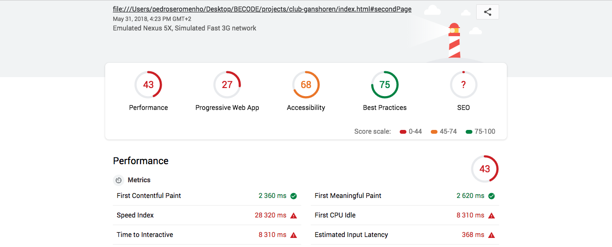

# One-Pager Website
- **Client** :Ganshoren Shooting Club
- **Where ?** : At [Becode](https://github.com/becodeorg/)
- **When ?** :  From 31/05/2018 to ?
- **By who ?** : [Me](https://github.com/pedroseromenho/)
- **The Website** : [HERE](https://pedroseromenho.github.io/projects/club-ganshoren/index.html#firstPage) - *Phase 1 version*.

## About

[FR]
Dans le cadre de ma formation de web devellopeur à [Becode](https://github.com/becodeorg/), le [Fil rouge](https://github.com/becodeorg/lovelace-2/edit/master/Projects/fil-rouge/), est un projet qui a pour objectifs de nous permettre d'apprendre sur base de demandes réalistes.
Chaque projet est inspiré de situations et besoins réels, mais **ne fera pas l'objet d'une remise à un client "réel"**.

## Phases

- **Phase 1** : (guerilla style) : un one-pager en 8 heures.
- **Phase 2** : (managed style) : étude de la demande
- **Phase 3** : Design de la solution "one-pager v2"
- **Phase 4** : Création d’un "multipage website"
- **Phase 5** : développement d'un Backoffice (CMS)
- **Phase 6** : Application mobile / PWA

## Phase 1: Guerilla

- repository : `filrouge-0-guerrilla`
- team : `false`
- Durée : `21600s`
- remise: [formulaire](https://goo.gl/forms/ov5m6hVD4ZUxY2Yc2)

### Objectifs

- Réaliser un one-pager.
- Choisir une template sur [html5up.net](https://html5up.net/) (ou autre)
- Le modifier en utilisant le contenu rassemblé
- Une fois publié, utiliser le [Lighthouse Test](https://developers.google.com/web/tools/lighthouse/) et améliore le code pour améliorer ses scores dans tous les domaines.
- Si possible, trouve un nom de domaine gratuit
- Publier le résultat sur ce [formulaire](https://goo.gl/forms/ov5m6hVD4ZUxY2Yc2) avant la fin de la deadline.

#### Difficultés rencontrées

Face à ce challenge, réaliser un site web *satisficing* en six heures est en réalité très difficile. Mon projet, étant de réaliser un site pour un centre de tir, j'ai eu des difficultés à rassembler un contenu qui était quasi innexistant. Merci [Guillaume]() ! :-P
Ayant peu d'éléments, j'ai opté par réaliser ma propre maquette, plutôt que prendre un template. En me disant qu'une bonne maquette permet un code facile, j'ai y passé ma matinée dessus. 

#### Méthodes de travail

- De façon à rendre le projects dans les délais, j'ai fouillé dans mes projets projets précédents, en espèrant trouver des éléments qui fonctionneraient avec la maquette dessiné.
- J'ai trouvé un site que j'avais fait avec le pluggin `fullpage.js` de [Alvaro Trigo](https://github.com/alvarotrigo/fullPage.js/). Ce pluggin permet de faire des *one-pager* en responsive, des transitions entre sections, entre autres.
- En amont j'ai exploré les animations css pour créer une [cible en animation](https://codepen.io/pedroseromenho/pen/GGJKog). C'est encore à retravailler, pour eventuellement la rajouter plus tard autant que `screen splash` ou autre.
- Malgré le côté pratique du pluggin `fullpage.js`, j'ai eu face à des problèmes de responsive. Ce pluggin contient son propre css et je n'ai pas dédié assez de temps pour le craquer correctement.

#### Test lighthouse

Le résultat n'est pas assez satisfaisant. Le pluggin detecte des problèmes de lisibilité, du code en trop,... En effet la typo choisie en blanc dans le `menu` et le `footer` ne facilite pas la lecture.

#### Le Mockup

[HERE PDF](https://github.com/pedroseromenho/projects/edit/master/club-ganshoren/mockup.pdf)

#### Objectifs Phase 2

- Réaliser une maquette mobile, et corriger les problèmes de lisibilité sur celle du desktop.
- Ajouter les *social links* dans la maquette.
- Ajouter des animations css (ou javascript) pour le rendre plus attractive.
- Réaliser des vrais formulaires.
- Prendre le temps de faire des vrais `table`en html et css.
- Corriger les responsive sur tous les types d'écran.
